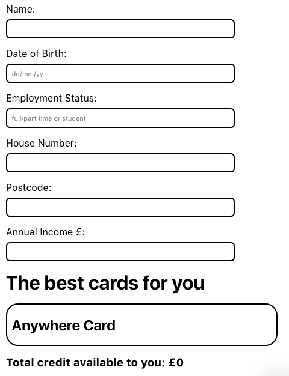
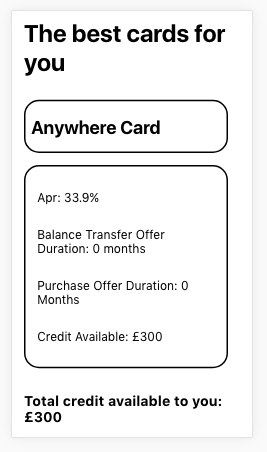

# cards

A React SPA project for showing credit card information based on the user's details.

## Example views

## Setup

- Git clone the repo to download the project files.

- In the terminal run: `npm install` to install all the dependencies for the project.

- Run `npm start` to get the app started.

- Head to http://localhost:3000/ in the browser to see it.

## Testing

Run `npm run test` to run the test suites

I have written a few basic tests using Jest and Enzyme. As TDD is very important to me I wanted to approach the task using that methodology. However, given time restraints I started the project and then wrote the tests. You can run the test suite by running `npm test` in the terminal. I have used a mix of unit and snapshot tests for each component. I have kept the failing tests in the suite to show progress. This includes testing the input of 'student' in the employment status form field and mocking the onClick on the card. If I had more time I would like to fix them! It has been tricky to test fully as I have used Styled Components which may affect Jest and Enzyme testing.

## My approach

I started out by setting up a simple create-react-app project as I wanted to jump into development quickly. I then moved on to the Form, building the form fields. I then created the cards, which include the card name separate from the details. When you click the card name it renders the card details below it. Then I moved on to the next requirement which is showing the total credit for selected cards. By adding the 'selected' prop as state to the click handler function I could then use it for showing the selected cards' total credit. After completing the requirements I worked on the styling, including adding responsiveness for the iPhone 5 and desktop breakpoints. I then wrote the tests, bringing in Enzyme and React Test Renderer for snapshot tests.

## Due to time constraints

If I had more time to work on this project I would like to fix the failing tests and write more tests to cover all the code. I have deliberately put the cards in the Form component, which ideally should be separated. This is because as props only flow downwards and the props from the form needed to be passed to the app component. This approach would involve using Redux, which I didn't have time to implement. I would also like to move the logic functions out of the form component and import them instead. The cards do not toggle and clicking the cards multiple times continues to ad their respective credit to the total. This needs to be fixed in the future. The styling can also be improved to usability and I would add more breakpoints to the design.
